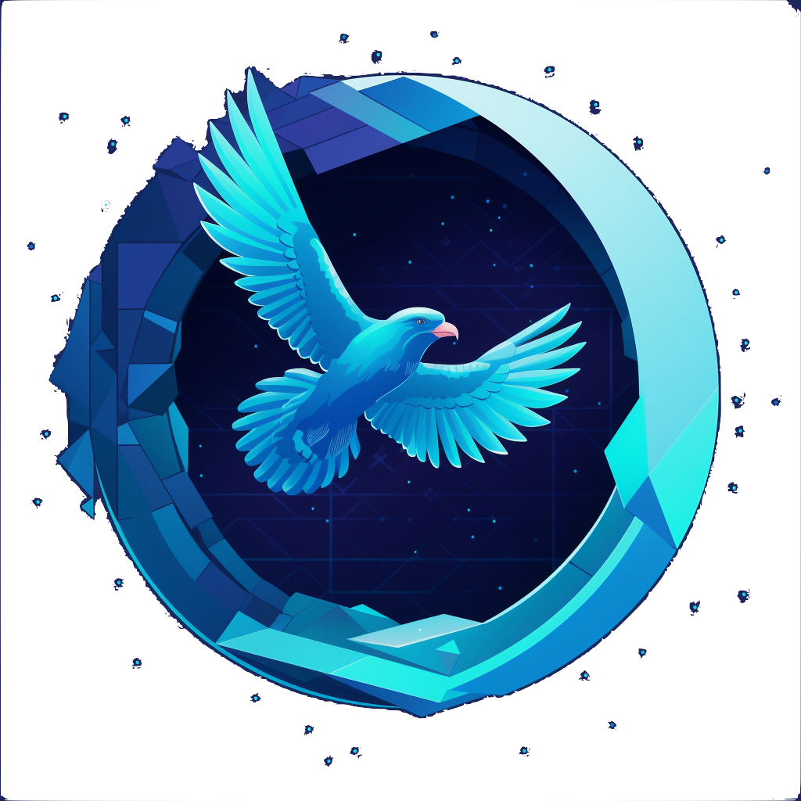

# Aragon Fam

A portal for your Aragon DAO to any chain.
Right now it supports any OP based L2 through the official bridge. But I'm working on adding other rollups and chains like Polygon.


## Local build & testing

This repo uses Foundry. Install it as follows:
```
curl -L https://foundry.paradigm.xyz | bash
foundryup
```

Install dependencies:
```
forge install
```

Build contracts:
```
forge build
```

Run tests:
```
forge test
```

## Deployment

Run the deploy script first to verify that can be broadcasted:
```
forge script Deploy --verify -vvvv --rpc-url <<chain config name>>
```

Run again broadcasting to the desired chain:
```
forge script Deploy --broadcast --verify -vvvv --rpc-url <<chain config name>>
```

## Verifying

Take a look at [Foundry Deploying and Verifying](https://book.getfoundry.sh/forge/deploying).

Forge's built-in verifying functionality use to fail with this codebase. To troubleshoot this, we manually verify with Etherscan using JSON-standard-input format. You can find the verification files under `build-inputs` directory.

Shortcut to get the latest input sources:
```
rm -r build-info;
forge build --force --optimize --optimizer-runs 20000 --build-info --build-info-path build-info;
jq .input build-info/*.json > inputs.json;
rm -r build-info;
```
